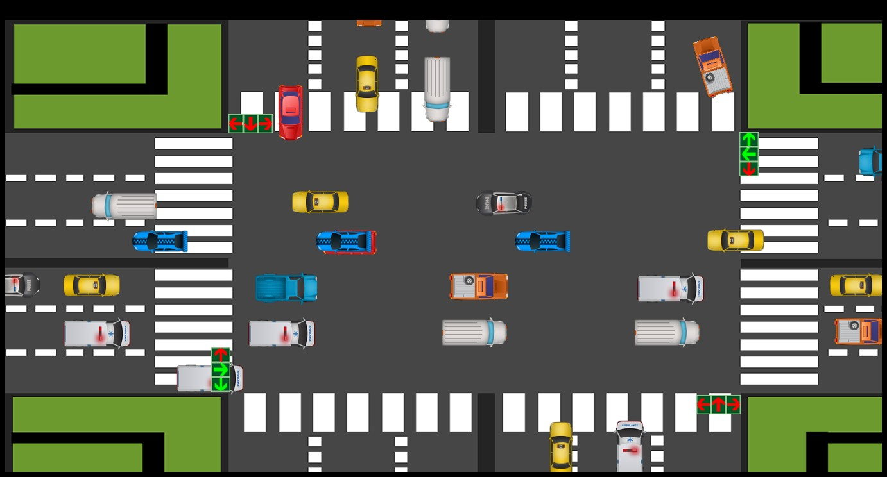

# Source

https://github.com/Dna072/Traffic-Simulator

# Traffic-Simulator

2D Traffic simulation of a crossed junction double road (with pedestrian crossing) traffic simulation with total of 10 traffic lights each with one minute transition time. Simulated vehicles have the ability to move and access all routes possible while avoiding possible collisions.